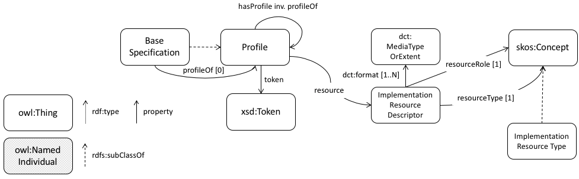

# DXWG's Profile Descriptor

This component of the [Data Exchange Working Group](https://www.w3.org/2017/dxwg/)'s code repository is for work on the *Profile Descriptor* task.

## Profiles Description Ontology
An ontology to describe objects relevant to profiling (original specifications profiled, profiles of profiles, categorisation of profiling methods) is proposed. See [profiledesc.ttl](profiledesc.ttl) in this folder for the source and <https://promsns.org/def/prof> for a demo of the ontology documented in HTML. Additionally, the main classes and their relations are summarized here: 

  
Figure 1: Profile description ontology

See [ontology documentation](https://w3c.github.io/dxwg/profiledesc/profiledesc.html) and [examples here](examples). 

## Next Steps
The DXWG has yet, as of the start of May 2018, not decided how it will address its original charter deliverable to provide **profile guidance**. Once a decision has been made (likely during the May, 2018, WG face-to-face meeting) work here will be folded into that initiative.
