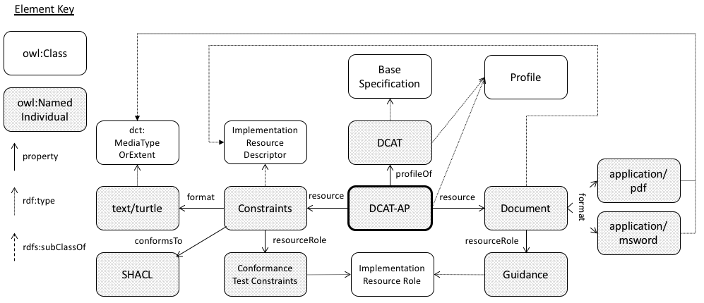
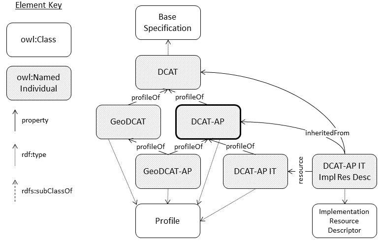
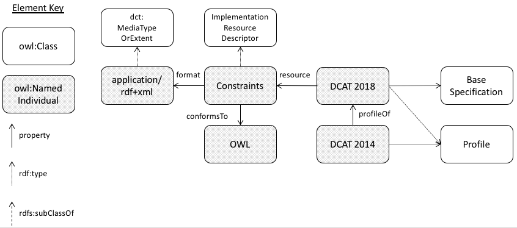
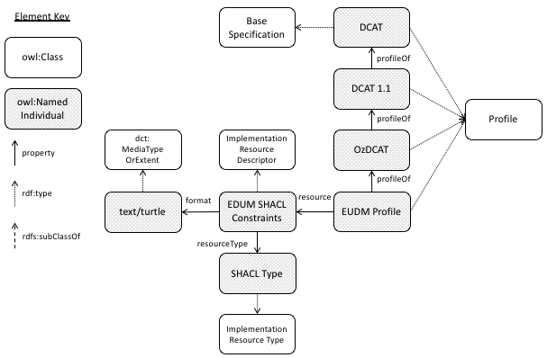
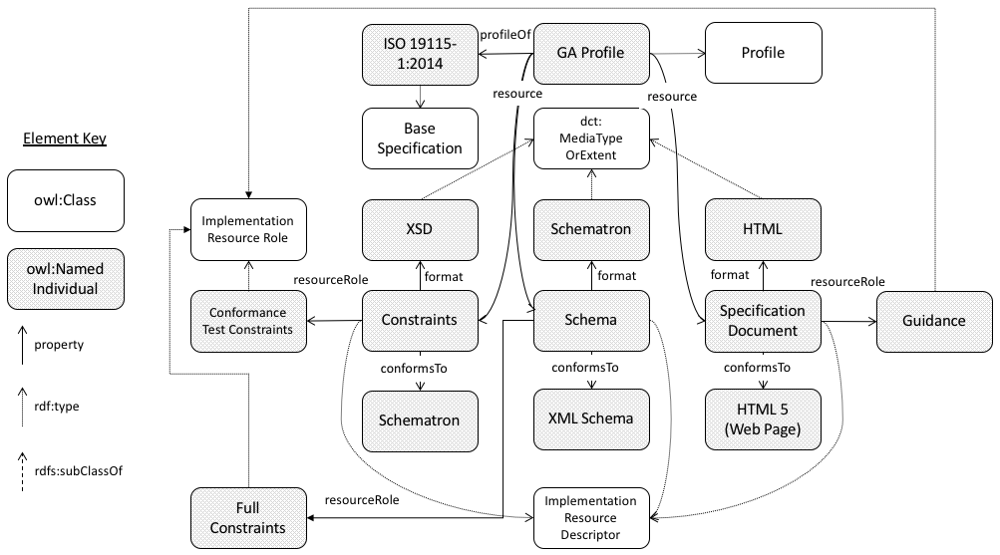

# Profile Descriptions examples
Here are some examples of the Profile Descriptions Ontology modelling existing or expected profile.

### DCAT-AP
DCAT-AP is the widely used European *Application Profile* of DCAT. DCAT-AP's specification is available in document form (PDF & DOCX) which has the role of *Guidance* and is also available in machine-readable form, using the SHACL RDF constraints language, which has the role *Conformance Test Constraints*.

The current state of DCAT-AP usage already exhibits nested inheritance and multiple different types of implementation resources, of which a few examples are shown here. 

The degree to which categorisation of roles is explicity supported is a subject for discussion.

The RDF for this example is in [profiledesc_examples.ttl](profiledesc_examples.ttl).

  
Figure 1: DCAT-AP profile of DCAT

Additionally, there are a range of national DCAT-AP profiles, such as DCAT-AP IT (Italy) which profile DCAT-AP and also other non-national profiles such as GeoDCAT-AP. Note that GeoDCAT-AP profiles both DCAT-AP *and* GeoDCAT.

  
Figure 2: Further DCAT-AP profiling

### DCAT
Depending on backwards compatibility outcomes, it is possible that the original DCAT (2014) may be a strict profile of the newer version of DCAT (2018) currently under consideration. This is because the 2018 version will be broader (relaxed constraints and with more general classes available) than the original 2014 version and entirely backwards-compatible with it.

The RDF for this example is in [profiledesc_examples.ttl](profiledesc_examples.ttl).

  
Figure 3: DCAT profiles

### EUDM
The Energy Use Data Model is an energy data platform project in Australia. It will profile an Australian government profile of DCAT (termed OzDCAT here).

  
Figure 4: EUDM profile

### Geoscience Australia
Here the Profile Descriptions Ontology is put to use describing profiling of non-Semantic Web standards. Geoscience Australia, an Australian government geoscience data agency, has recently profiled the ISO19115-1:2014 Geographic metadata standard. That profile is described in three ways:

1. **HTML Web Page**: a human-readable web page offering a comprehensive description of the profile <http://pid.geoscience.gov.au/def/schema/ga/ISO19115-1-2014>
2. **XML Schema Description**: an XML schema that can be used to check XML instances of the profile for conformance <http://pid.geoscience.gov.au/def/schema/ga/ISO19115-3-2016>
3. **Schematron**: an XML assertion language resource that can be used to constraint check XML instances of the profile <http://pid.geoscience.gov.au/def/schema/ga/ISO19115-3-2016/schematron-rules-ga.sch>

These profile descriptions are termed `Implementation Resource Descriptor` instances in the diagram and are typed according to their functional role.

The RDF for this example is in [eg_ga.ttl](eg_ga.ttl).

  
Figure 5: Geoscience Australia profile

### Open Geospatial Consortium

The RDF for this example is in [profiledesc_examples.ttl](profiledesc_examples.ttl).

*Figure coming soon!*
