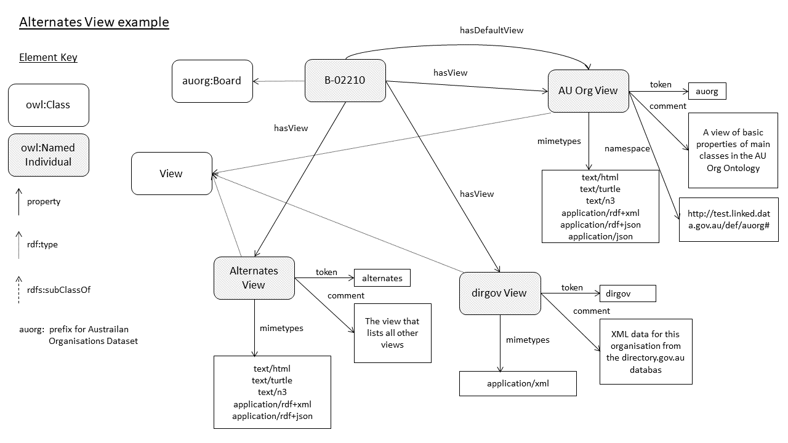

# Profile negotiation - proposal

There is a convention implemented by some Linked Data platforms to provide access to different model *views* of a resource by use of the query string argument `_view` and for MIME type selection by use of `_format` that may be in addition to regular HTTP Accept Header MIME format requests. This allows the following:

URI | Description of dereferencing
----|-----------------------------
`http://example.org/dataset/ds1` | Base URI of a resource giving default model view and MIME type (format)
`http://example.org/dataset/ds1` + **?_view=dcat** | The "DCAT" view of the resource, default MIME type
`http://example.org/dataset/ds1` + **?_view=dcat&_format=text/turtle** (or perhaps _format=turtle or _format=ttl) | The "DCAT" view of the resource, serialised in turtle

### Informal modelling
Informally we may say that:

* each resource must have 1+ *views*
* each view must have 1+ *formats* (MIME types)
* if not specified, a default view and format are given

## Alternates View
The convention requires a special view, the *alternates* view, to be given that lists all other views: `http://example.org/dataset/ds1` + **?_view=alternates**.

One currently implemented system using an *Alternates View* like this showing the delivery of metadata according to Semantic Web ontologies and also legacy XML formats as well as HTML web pages can be seen for the Geoscience Australia Samples Register's samples:

<http://pid.geoscience.gov.au/sample/AU239?_view=alternates>

### Informal modelling
The information contained in the alternates view, at least as per the above implementation, can be informally modelled as:

* each *view* has a *token*
  * used to create a query string to access it, viz. `{RESOURCE_URI}?_view={TOKEN}`
* each view has a `label` and a `comment`
* each view *may* have a *namespace* (URI) indicated
* each view must have 1+ MIME type expressed as per strings as per [Mozilla's incomplete list of them](https://developer.mozilla.org/en-US/docs/Web/HTTP/Basics_of_HTTP/MIME_types/Complete_list_of_MIME_types)

### Example
In another implementation for the Australian Government's test Government Organisations Register (<http://test.linked.data.gov.au/dataset/auorg>), the *alternates view* of an Organisation resource lists an *AU Org*, a *dirgov* and an *alternates* view for each Organisation. This, for a particular organisation, `B-02210`, is modelled as per Listing 1 & Figure 1 below.

```
@prefix ereg: <http://promsns.org/def/eregistry#> .
@prefix rdf: <http://www.w3.org/1999/02/22-rdf-syntax-ns#> .
@prefix rdfs: <http://www.w3.org/2000/01/rdf-schema#> .
@prefix xml: <http://www.w3.org/XML/1998/namespace> .
@prefix xsd: <http://www.w3.org/2001/XMLSchema#> .

<http://test.linked.data.gov.au/board/B-02210>
  ereg:hasDefaultView _:v1 ;
  ereg:view _:v1, _:v2:, _:v3 .

  _:v1 a ereg:View ;
      rdfs:label "AU Org View"^^xsd:string ;
      ereg:hasDefaultFormat "text/turtle"^^xsd:string ;
      ereg:mimetype "application/json"^^xsd:string,
          "application/rdf+json"^^xsd:string,
          "application/rdf+xml"^^xsd:string,
          "text/html"^^xsd:string,
          "text/n3"^^xsd:string,
          "text/turtle"^^xsd:string ;
      ereg:namespace "http://promsns.org/def/eregistry#"^^xsd:string ;
      ereg:token "auorg"^^xsd:string ;
      rdfs:comment "A view of basic properties of main classes in the AU Org Ontology"^^xsd:string .

_:v2 a ereg:View ;
    rdfs:label "dirgovau View"^^xsd:string ;
    ereg:hasDefaultFormat "text/xml"^^xsd:string ;
    ereg:mimetype "text/xml"^^xsd:string ;
    ereg:token "dirgov"^^xsd:string ;
    rdfs:comment "XML data for this organisation from the directory.gov.au database"^^xsd:string .

_:v3 a ereg:View ;
  rdfs:label "Alternates"^^xsd:string ;
  ereg:hasDefaultFormat "text/html"^^xsd:string ;
  ereg:mimetype "application/json"^^xsd:string,
      "application/rdf+json"^^xsd:string,
      "application/rdf+xml"^^xsd:string,
      "text/html"^^xsd:string,
      "text/turtle"^^xsd:string ;
  ereg:token "alternates"^^xsd:string ;
  rdfs:comment "The view that lists all other views"^^xsd:string .
```
**Listing 1**: RDF (turtle) example data for the *Alternates View* of resource <http://test.linked.data.gov.au/board/B-02210>


**Figure 1**: Graphical representation of Listing 1

# Proposal to use profiledesc
We propose to model the contents of the Alternates View of objects using this Profiles Description Ontology. For the example in Listing 1 & Figure 1, the modelling could be as per Figure 2 below.


**Figure 2**: A Profiles Description Ontology modelling of the example in Listing 1 & Figure 1.

### Benefits
Currently, there is no formal model to inform a machine of the different model views and formats available for a resource. We believe it straightforward to use the Profiles Description Ontology as outlined in Figure 2 above. Basic human-readable descriptions of model view and formats are directly catered for using the properties already suggested for use in the Ontology and the descriptions of the specifications to which various views conform is handled better: whereas in the current alternates view, a *namespace* is indicated for a view, using ProfDesc, a view can be much better described using a `Profile` (or a `Base Specification`) and an `Implementation Resource Descriptor` and all the standard ProfDesc constructs.
